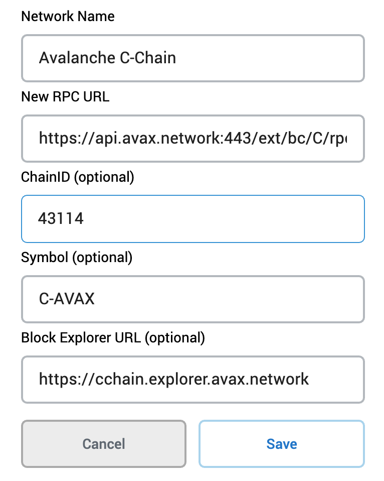

# Deploy a Smart Contract on Avalanche using Remix and MetaMask

The Avalanche network is a subnet that has three chains: P-Chain, X-Chain, and C-Chain.

The C-Chain is an instance of the Ethereum Virtual Machine powered by Avalanche’s Snowman consensus engine.

The [C-Chain RPC](https://docs.avax.network/v1.0/en/api/evm) can do anything a typical Ethereum client can by using the Ethereum-standard RPC calls. The immediate benefits of using the C-Chain rather than Ethereum are quick blocktimes which finalize in under 3 seconds, high transactional throughput, and lightweight clients that do not require Proof of Work. These properties that could considerably improve the performance of DApps and the user experience.

Today we will deploy and test a smart contract on Avalanche using Remix and MetaMask.

## Step 1. Setting up MetaMask

* **Network Name**: Avalanche C-Chain
* **New RPC URL**:
    * n/a for Localnet
    * [https://api.avax-test.network/ext/bc/C/rpc](https://api.avax-test.network/ext/bc/C/rpc) for Fuji Testnet
    * [https://api.avax.network/ext/bc/C/rpc](https://api.avax.network/ext/bc/C/rpc) for Mainnet
* **ChainID**:
    * `43112` for Localnet
    * `43113` for Fuji Testnet
    * `43114` for Mainnet
* **Symbol**: C-AVAX
* **Explorer**:
    * n/a for Localnet
    * [https://cchain.explorer.avax-test.network](https://cchain.explorer.avax-test.network) for Fuji Testnet
    * [https://cchain.explorer.avax.network](https://cchain.explorer.avax.network) for Mainnet

## Step 2. Funding your C-Chain address

Navigate to [https://faucet.avax.network](https://faucet.avax.network) and paste your C-AVAX address. All you need to do is add a “C-” prefix and the faucet will switch from AVAX to C-AVAX.

## Step 3. Remix: Connect MetaMask and deploy a smart contract.

Open [Remix](https://remix.ethereum.org) -> Select Solidity

Load or create the smart contracts that we want to compile and deploy using Remix file explorer.

For this example, we will deploy an ERC20 contract from [OpenZeppelin](https://openzeppelin.com/contracts)

Navigate to Deploy Tab -> Open the “ENVIRONMENT” drop-down and select Injected Web3 (make sure MetaMask is loaded)

Once we injected the web3-> Go back to the compiler and compile the selected contract -> Navigate to Deploy Tab

Now the smart contract is compiled, MetaMask is injected, and we are ready to deploy our ERC20. Click “Deploy”

Confirm the transaction on the MetaMask popup

Our contract is successfully deployed!

Now we can expand it by selecting it from the “Deployed Contracts” tab and test it out.

The contract ABI and Bytecode are available on the compiler tab

If you had any difficulties following this tutorial or simply want to discuss Avalanche tech with us you can join our community at [Discord](https://chat.avalabs.org)!
